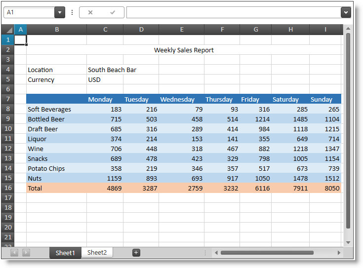

////
|metadata|
{
    "name": "spreadsheet-features",
    "tags": ["Getting Started"],
    "controlName": ["{SpreadsheetName}"],
    "guid": "80c536e9-3d05-4854-8390-d69eaeb66e63",
    "buildFlags": [],
    "createdOn": "2015-11-06T16:53:37.0373883Z"
}
|metadata|
////

= Features Overview ({SpreadsheetName})

== Topic Overview

=== Purpose

This topic explains the features supported by the control from a developer's perspective.

=== Required background

The following table lists the concept and topic required as a prerequisite to understanding this topic.

[options="header", cols="a,a"]
|====
|Type|Content

|Concept
|Infragistics Excel Engine
|====
[options="header", cols="a,a"] 

|==== 

|Topic|Purpose 

|pick:[xaml=" link:igexcelengine-about-infragistics-excel-engine.html[About Infragistics Excel Engine]"] pick:[win-forms=" link:excelengine-understanding-the-infragistics-excel-engine.html[Understanding Infragistics Excel Engine]"] 

|In this section you will find information that will help you to better understand the object model and the functionalities of the _Infragistics Excel Engine_ . 

|====

=== In this topic

This topic contains the following sections:

* <<_Ref396119088, Introduction >>
* <<_Ref396119094, Main Features >>
* <<_Ref396119101, Related Content >>

[[_Ref396119088]]
== Introduction

The following screenshot shows the link:{SpreadsheetLink}.{SpreadsheetName}.html[{SpreadsheetName}] control displaying some spreadsheet data:

=== {SpreadsheetName} summary

The {SpreadsheetName} control allows visualizing and editing of spreadsheet data, represented by the data model supported by the  pick:[wpf,sl,xaml=" link:igexcelengine-about-infragistics-excel-engine.html[Infragistics Excel Engine]"]   pick:[win-forms=" link:win-infragistics-excel-engine.html[Infragistics Excel Engine]"]  comprising of link:{ApiPlatform}documents.excel.v{ProductVersion}~infragistics.documents.excel.workbook.html[Workbooks], link:{ApiPlatform}documents.excel.v{ProductVersion}~infragistics.documents.excel.worksheet.html[Worksheets], link:{ApiPlatform}documents.excel.v{ProductVersion}~infragistics.documents.excel.worksheetcell.html[Cells], link:{ApiPlatform}documents.excel.v{ProductVersion}~infragistics.documents.excel.formula.html[Formulas] and more.

The following screenshot shows the {SpreadsheetName} control displaying some spreadsheet data:

[[_Ref396119094]]
== Main Features

=== Main features summary chart

The following table summarizes the main features of the {SpreadsheetName} control. Additional details are available after the summary table.

[options="header", cols="a,a"]
|====
|Feature|Description

|<<_Ref395877610,Cell Alignment>>
|The control supports many cell’s content alignments.

|<<_Ref395876419,Cell Borders>>
|The control supports cell borders.

|<<_Ref395874256,Cell Fill>>
|The control supports different cell fill.

|<<_Ref396145620,Cell In-Place Editing>>
|The control supports "in-place" cell editing.

|<<_Ref395886158,Commands>>
|The control supports a large number of commands.

|<<_Ref395881898,Context Menu>>
|The control supports context menu.

|<<_Ref395881763,Copy and Paste>>
|The control has full clipboard support.

|<<_Ref395880031,Data Validation>>
|The control supports data validation of the user input.

|<<_Ref395880032,Font Styles>>
|The control supports text font styling.

|<<_Ref396117365,Formula Bar>>
|The control supports content editing using a formula bar.

|<<_Ref395885169,Freezing Panes>>
|The control allows freezing of top row(s) and/or left column(s).

|<<_Ref395865751,Gridlines>>
|The control can show grid lines used to separate cells.

ifdef::xaml[]
|<<_Ref395865766,Headers>>
|The control can show columns’ and rows’ headers.
endif::xaml[]

ifdef::xaml[]
|<<_Ref395887540,Hiding>>
|The control supports hiding of columns and rows.
endif::xaml[]

|<<_Ref395887541,Hyperlinks>>
|The control supports hyperlinks.

ifdef::xaml[]
|<<_Ref395887542,Inserting and Deleting Cells, Columns and Rows>>
|The control supports cells, columns and rows managing.
endif::xaml[]

|<<_Ref395887547,Resizing>>
|The control supports resizing of columns and rows.

|<<_Ref395886043,Shapes Support>>
|The control supports shapes.

|<<_Ref395797889,Selection>>
|The control supports several selection modes which may be switched programmatically or by the user.

ifdef::xaml[]
|<<_Ref395884699,Splitting Panes>>
|The control supports splitting of the worksheet view into panes.
endif::xaml[]

|<<_Ref396146031,Tab Bar Area>>
|The control supports dedicated tabs area for switching between worksheets.

|<<_Ref395883789,Undo and Redo>>
|The control supports unlimited undo and redo operations.

|<<_Ref395885466,Worksheet Background>>
|The control supports worksheet background image.

ifdef::xaml[]
|<<_Ref395883004,Zooming>>
|The control supports worksheet content zooming.
endif::xaml[]

|====

[[_Ref395877610]]

=== Cell Alignment

The control supports many horizontal and vertical cell content alignments. Indentation, text wrap, shrink to fit and cell merging are also supported.

.Note
[NOTE]
====
Content justify, text direction (different from left to right), rotation and vertical text are not supported.
====

[[_Ref395876419]]

=== Cell Borders

The control supports cell borders and edges with different styles and colors. Diagonal borders are also supported. The control does not scale border lines when zooming.

[[_Ref395874256]]

=== Cell Fill

The control supports different cell fills like solid fill, gradient effect fill, pattern color and pattern style.

[[_Ref396145620]]

=== Cell In-Place Editing

The control supports fully featured "in-place" cell editing using an editor positioned over cell which is being edited. The user may edit cell’s formatted string or formula.

==== Related Topic:

link:spreadsheet-uiu-cell-editing.html[Cell Editing Interactions ({SpreadsheetName})]

ifdef::xaml[]

[[_Ref395886158]]

=== Commands

The control provides a lot of commands for activating different features.

==== Related Topic:

link:spreadsheet-work-commands.html[Working with Commands ({SpreadsheetName})]

endif::xaml[]

ifdef::xaml[]

[[_Ref395881898]]

=== Context Menu

The control provides contextual menus allowing the user to perform different operations depending on the selected visual element.

==== Related Topic:

link:spreadsheet-uiu-context-menu.html[Context Menu Interactions ({SpreadsheetName})]

endif::xaml[]

[[_Ref395881763]]

=== Copy and Paste

The control supports clipboard copying of information between cells, sheets and also between external applications (like MS Excel).

==== Related Topic:

link:spreadsheet-work-clipboard.html[Working with Clipboard ({SpreadsheetName})]

[[_Ref395880031]]

=== Data Validation

The control supports a data validation feature which allows validation of the user input based on validation rules set on the cells. Your rules configuration also includes an input message and an error message dialog shown when the user input does not pass the validation.

==== Related Topic:

link:spreadsheet-uiu-data-validation.html[Data Validation Interactions ({SpreadsheetName})]

[[_Ref395880032]]

=== Font Styles

The control supports the following text properties - font family, font size, bold, italic, underline, double underline, strikethrough and color. The control renders superscript and subscript based on the entire line height and not based on the font height.

.Note
[NOTE]
====
You may notice rendering difference comparing to MS Excel when having underline, small super or subscript text and large sized text on the same line.
====

[[_Ref396117365]]

=== Formula Bar

The control allows the user to edit cell text and formulas. The name box of the formula bar allows the user to define named references (to cell or cell ranges) and quickly navigate to the appropriate cell or cell range(s). The formula bar also supports multiple line content editing.

==== Related Topic:

link:spreadsheet-uiu-formula-bar.html[Formula Bar Interactions ({SpreadsheetName})]

[[_Ref395885169]]

=== Freezing Panes

The control allows freezing of top row(s) and/or left column(s). Frozen row(s) and/or column(s) remain visible at all time while the user is scrolling.

==== Related Topic:

pick:[xaml="link:igexcelengine-freeze-rows-and-columns.html[Freezing and Splitting Panes (Infragistics Excel Engine)]"] 
pick:[win-forms="link:excelengine-freeze-rows-and-columns.html[Freezing Rows and Columns (Infragistics Excel Engine)]"]

[[_Ref395865751]]

=== Gridlines

The control can show or hide the grid lines used to separate the worksheet’s cells. Dotted lines are drawn when a custom color is used for the grid line color. Grid lines are not rendered for cells where borders or background are present.

==== Related Topic:

pick:[xaml="link:igexcelengine-configuringgridlines.html[Configuring the Gridlines (Infragistics Excel Engine)]"]
pick:[win-forms="link:excelengine-applying-styles-to-cells.html[Applying Styles to Cells]"]

ifdef::xaml[]

[[_Ref395865766]]

=== Headers

The control can show or hide the columns’ and rows’ headers.

==== Related Topic:

link:igexcelengine-configuringheaders.html[Configuring the Headers (Infragistics Excel Engine)]

endif::xaml[]

ifdef::xaml[]

[[_Ref395887540]]

=== Hiding

The control supports hiding of columns and rows. The user can start resizing a column or row and shrink it to a point where it is no longer visible. A special indicator will be rendered at the place of the hidden column or row allowing it to be made visible again.

==== Related Topic:

link:spreadsheet-uiu-columns-and-rows.html[Columns and Rows Interactions ({SpreadsheetName})]

endif::xaml[]

[[_Ref395887541]]

=== Hyperlinks

The control supports hyperlinks defined in both the underlying object model and as a worksheet cell formula.

.Note
[NOTE]
====
Hyperlinks are not supported on shapes.
====

==== Related Topic:

ifdef::win-forms[]
link:excelengine-adding-a-hyperlink-to-a-cell-in-an-excel-file.html[Adding a Hyperlink to a Cell in an Excel File]
endif::win-forms[]

ifdef::xaml[]
* link:spreadsheet-uiu-hyperlinks.html[Hyperlinks Interactions ({SpreadsheetName})]
* link:spreadsheet-work-hyperlinks.html[Working with Hyperlinks ({SpreadsheetName})]

endif::xaml[]

ifdef::xaml[]

[[_Ref395887542]]

=== Inserting and Deleting Cells, Columns and Rows

The control supports cells, columns and rows managing programmatically.

==== Related Topic:

link:igexcelengine-inserting-and-deleting-cells.html[Inserting and Deleting Cells, Column and Rows (Infragistics Excel Engine)]

endif::xaml[]

[[_Ref395887547]]

=== Resizing

The control supports resizing of columns and rows. The user can resize columns and rows by dragging the mouse at the border between two columns headers or two row headers and resize the column or row. Auto-sizing is also supported by double-clicking on the right border of a column header or double-clicking on the bottom border of a row header.

==== Related Topic:

link:spreadsheet-uiu-columns-and-rows.html[Columns and Rows Interactions ({SpreadsheetName})]

[[_Ref395886043]]

=== Shapes Support

The control supports different kind of objects (like shapes and images). The objects are rendered in a separate (from the cell content) layer and they may move and/or resize based on the cells they are positioned over. Object rotation and different transformations (such as horizontal and vertical flipping) are supported.

.Note
[NOTE]
====
Currently manipulation of the shapes is not possible through the user interface.
====

==== Related Topics:

*  pick:[xaml=" link:igexcelengine-adding-a-shape-to-an-excel-worksheet.html[Adding a Shape to a Worksheet (Infragistics Excel Engine)]"]  pick:[win-forms=" link:excelengine-adding-shapes-to-a-worksheet.html[Adding a Shape to a Worksheet (Infragistics Excel Engine)]"] 
*  pick:xaml=" link:igexcelengine-addingimagetoworksheet.html[Adding an Image to a Worksheet (Infragistics Excel Engine)]"]  pick:[win-forms=" link:excelengine-add-an-image-to-a-worksheet.html[Adding an Image to a Worksheet (Infragistics Excel Engine)]"] 

[[_Ref395797889]]

=== Selection

The control supports several selection modes which may be switched programmatically or by the user. The currently selected cells can be set and obtained programmatically.

==== Related Topics:

* link:spreadsheet-uiu-selection.html[Selection Interactions ({SpreadsheetName})]
* link:spreadsheet-conf-selection.html[Configuring Selection ({SpreadsheetName})]
* link:spreadsheet-work-selection.html[Working with Selection ({SpreadsheetName})]

ifdef::xaml[]

[[_Ref395884699]]

=== Splitting Panes

The control supports splitting the worksheet view into panes. Each scrollable pane row and column has its own scrollbar.

==== Related Topic:

pick:[xaml="link:igexcelengine-freeze-rows-and-columns.html[Freezing and Splitting Panes (Infragistics Excel Engine)]"]

endif::xaml[]

[[_Ref396146031]]

=== Tab Bar Area

The control supports dedicated tabs area for switching between worksheets.

==== Related Topics:

* link:spreadsheet-uiu-tab-bar-area.html[Tab Bar Area Interactions ({SpreadsheetName})]
* link:spreadsheet-conf-tab-bar-area.html[Configuring Tab Bar Area ({SpreadsheetName})]

[[_Ref395883789]]

=== Undo and Redo

The control uses the IG Undo/Redo Framework to provide unlimited undo and redo operations. You can enable/disable the undo and redo and also use separate or shared undo managers for each  _{SpreadsheetName}_  control.

==== Related Topic:

link:spreadsheet-work-undo-redo.html[Working with Undo and Redo ({SpreadsheetName})]

[[_Ref395885466]]

=== Worksheet Background

The control supports displaying a worksheet background image. The image is tiled in the worksheet’s background. The zooming feature affects the background image and the background image scrolls as panes scroll.

ifdef::xaml[]

[[_Ref395883004]]

=== Zooming

The control supports content zooming. The entire workbook content (text, images, shapes, shape borders, etc.) is scaled.

ifdef::xaml[]
Note:
endif::xaml[]

.Note
[NOTE]
====
The cell borders and cell gridlines are not scaled.
====

==== Related Topic:

link:igexcelengine-zoomlevel.html[Setting the Worksheet Zoom Level (Infragistics Excel Engine)]

endif::xaml[]

[[_Ref396119101]]
== Related Content

=== Topics

The following topics provide additional information related to this topic.

[options="header", cols="a,a"]
|====
|Topic|Purpose

| link:spreadsheet-visual-elements.html[Visual Elements Overview ({SpreadsheetName})]
|This topic provides an overview of the visual elements of the control.

| link:spreadsheet-user-interactions.html[User Interactions and Usability ({SpreadsheetName})]
|The topics in this section explain what actions can be performed by the user.

|====