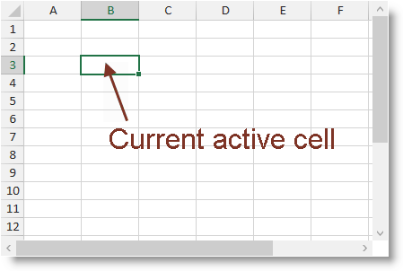

////
|metadata|
{
    "name": "spreadsheet-uiu-activation-navigation",
    "tags": ["Getting Started","Navigation"],
    "controlName": ["{SpreadsheetName}"],
    "guid": "62ba0ede-906f-4009-9255-1770ec49e224",
    "buildFlags": [],
    "createdOn": "2015-11-06T16:53:37.0433869Z"
}
|metadata|
////

= Activation and Navigation Interactions ({SpreadsheetName})

== Topic Overview

=== Purpose

This topic explains what actions can be performed by the user when navigating through the worksheet cells.

=== Required background

The following table lists the concept and topics required as a prerequisite to understanding this topic.

[options="header", cols="a,a"]
|====
|Type|Content

|Concept
|Infragistics Excel Engine
|==== 

[options="header", cols="a,a"] 

|==== 

|Topic|Purpose 

|pick:[xaml=" link:igexcelengine-about-infragistics-excel-engine.html[About Infragistics Excel Engine]"] pick:[win-forms=" link:excelengine-understanding-the-infragistics-excel-engine.html[Understanding Infragistics Excel Engine]"] 

|In this section you will find information that will help you to better understand the object model and the functionalities of the _Infragistics Excel Engine_ . 

| link:spreadsheet-features.html[Features Overview ({SpreadsheetName})] 

|This topic explains in details the features of the link:{SpreadsheetLink}.{SpreadsheetName}.html[{SpreadsheetName}] control from developer perspective. 

| link:spreadsheet-visual-elements.html[Visual Elements Overview ({SpreadsheetName})] 

|This topic provides an overview of the visual elements of the {SpreadsheetName} control. 

|====

=== In this topic

This topic contains the following sections:

* <<_Ref389753789, Activation >>
* <<_Ref389753795, Spreadsheet Panes >>
* <<_Ref389753801, Navigation >>
* <<_Ref389753815, User Interactions and Usability >>
* <<_Ref389753822, Related Content >>

[[_Ref389753789]]
== Activation

=== Activation summary

The {SpreadsheetName} control’s active cell is the cell on which the user may operate (for example edit its value). This active cell is highlighted with an additional border and also its row and column are highlighted with different background color.

The following screenshot shows the {SpreadsheetName} control with the cell at address B3 activated:

[[_Ref389753795]]
== Spreadsheet Panes

=== Spreadsheet Panes summary

The {SpreadsheetName} control supports sheet panes. Each sheet pane is an intersection of a region of columns and a region of rows from the currently selected worksheet. Spreadsheet panes are formed when you:

* Freeze rows and/or columns
* Create splits

There can be only one active sheet pane at a time and this is the sheet pane that has the focus. This pane also contains the active cell.

.Note
[NOTE]
====
Each sheet pane maintains its own selection information and also provides information about the rows and columns that are visible.
====

[[_Ref389753801]]
== Navigation

=== Navigation summary

The supports navigation of the active cell through the cells of the active pane of the currently selected worksheet. The user may change the active cell using the keyboard or mouse and also use the horizontal and vertical scroll bars to change the visible columns and rows of the active sheet pane.

.Note
[NOTE]
====
The active cell is also part of the active pane’s selection.
====

=== Navigation modes

In addition to the normal navigation behavior the {SpreadsheetName} control supports two more navigation modes:

*  *End Mode*  - in this mode the arrow keys are used to navigate adjacent cells with data.
*  *Scroll Lock*  – in this mode the arrow keys are used to scroll visible content of the worksheet instead of navigating the active cell.

[[_Ref389753815]]
== User Interactions and Usability

=== User interactions summary chart

The following table summarizes the main user interaction capabilities of the {SpreadsheetName} control.

[options="header", cols="a,a,a,a"]
|====
|The user can…|Using…|Details|Configurable?

|[[_Hlk377147553]] 

Activate a specific sheet cell
|
* Click on the specific cell 

* Navigate to this specific cell using the arrow keys 

|The specified cell will be activated
|image::images/No.png[]

|[[_Hlk377147649]] 

Activate the first column cell
|Press the HOME button
|The first cell on the current row will be activated. 

If end mode is selected the last cell with data will be activated. 

If scroll lock mode is selected the upper left cell in the view will be activated.
|image::images/No.png[]

|Activate the cell located on the first row and column
|Press Ctrl + Home keys
|The first cell on the first column will be activated
|image::images/No.png[]

|Go to the last used cell
|Press Ctrl + End
|Move the active cell to the last cell with value in the current sheet pane
|image::images/No.png[]

|Navigate one cell up
|Press Up arrow
|The cell above the current active cell will be activated
|image::images/No.png[]

|Navigate one cell down
|Press Down arrow
|The cell below the current active cell will be activated
|image::images/No.png[]

|Navigate one cell left
|
* Press Left arrow 

* Press Shift + Tab 

|The cell left from the currently active cell will be activated
|image::images/No.png[]

|Navigate one cell right
|
* Press Right arrow 

* Press Shift 

|The cell right from the currently active cell will be activated
|image::images/No.png[]

|Navigate page up
|Press Page Up
|Move active cell as much cells above as much rows are visible in the current sheet pane
|image::images/No.png[]

|Navigate page down
|Press Page Down
|Move active cell as much cells below as much rows are visible in the current sheet pane
|image::images/No.png[]

|Navigate page left
|Press Alt + Page Up
|Move active cell as much cells to the left as much columns are visible in the current sheet pane
|image::images/No.png[]

|Navigate page right
|Press Alt + Page Down
|Move active cell as much cells to the right as much columns are visible in the current sheet pane
|image::images/No.png[]

|Navigate a specific amount of rows up or down
|Scroll using the vertical scroll bar
|This changes the visible rows of the current sheet pane without changing the current active cell
|image::images/No.png[]

|Navigate a specific amount of columns left or right
|Scroll using the horizontal scroll bar
|This changes the visible columns of the current sheet pane without changing the current active cell
|image::images/No.png[]

|Enter/exit end mode navigation
|Press End
|The End key toggles the end mode navigation
|image::images/No.png[]

|Enter/exit scroll lock navigation mode
|Press Scroll Lock
|The Scroll Lock key toggles the scroll lock navigation mode
|image::images/No.png[]

|====

.Note
[NOTE]
====
If the user has more than one worksheet selected and changes the active cell, the new active cell will be synchronized across all selected worksheets.
====

[[_Ref389753822]]
== Related Content

=== Topics

The following topics provide additional information related to this topic.

[options="header", cols="a,a"]
|====
|Topic|Purpose

| link:spreadsheet-uiu-selection.html[Selection Interactions ({SpreadsheetName})]
|This topic explains what actions can be performed by the user when selecting worksheet cells.

| link:spreadsheet-conf-navigation.html[Configuring Navigation ({SpreadsheetName})]
|This topic explains how configure the navigation feature.

| link:spreadsheet-work-activation.html[Working with Activation ({SpreadsheetName})]
|This topic explains the activation feature from developer perspective.

| link:spreadsheet-work-selection.html[Working with Selection ({SpreadsheetName})]
|This topic explains the selection feature from developer perspective.

|====