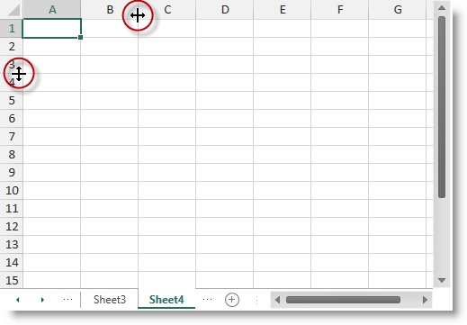
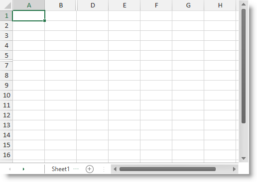
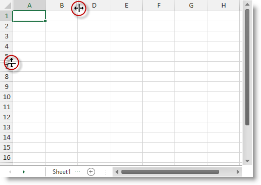

////
|metadata|
{
    "name": "spreadsheet-uiu-columns-and-rows",
    "tags": ["Getting Started","Layouts"],
    "controlName": ["{SpreadsheetName}"],
    "guid": "5cdb04b8-3923-4881-b067-3c8a5416e9be",
    "buildFlags": [],
    "createdOn": "2015-11-06T16:53:37.0474056Z"
}
|metadata|
////

= Columns and Rows Interactions ({SpreadsheetName})

== Topic Overview

=== Purpose

This topic explains what actions can be performed by the user when interacting with worksheet columns and rows.

=== Required background

The following table lists the concept and topics required as a prerequisite to understanding this topic.

[options="header", cols="a,a"]
|====
|Type|Content

|Concept
|Infragistics Excel Engine
|==== 
[options="header", cols="a,a"] 

|==== 

|Topic|Purpose 

|pick:[wpf,sl,xaml=" link:igexcelengine-about-infragistics-excel-engine.html[About Infragistics Excel Engine]"] pick:[win-forms=" link:excelengine-understanding-the-infragistics-excel-engine.html[Understanding Infragistics Excel Engine]"] 

|In this section you will find information that will help you to better understand the object model and the functionalities of the _Infragistics Excel Engine_ . 

| link:spreadsheet-features.html[Features Overview ({SpreadsheetName})] 

|This topic explains in details the features of the link:{SpreadsheetLink}.{SpreadsheetName}.html[{SpreadsheetName}] control from developer perspective. 

| link:spreadsheet-visual-elements.html[Visual Elements Overview ({SpreadsheetName})] 

|This topic provides an overview of the visual elements of the {SpreadsheetName} control. 

|====

=== In this topic

This topic contains the following sections:

* <<_Ref391050449, Row and Column Resizing >>
* <<_Ref391294869, Row and Column Hiding >>
* <<_Ref391295186, User Interactions and Usability >>
* <<_Ref389847446, Related Content >>

[[_Ref391050449]]
== Row and Column Resizing

=== Row and column resizing summary

The {SpreadsheetName} control supports column and row resizing using the mouse resize handles shown between the column and row headers. After moving the mouse over the resize handle the user may resize the column by dragging the resize handle.

The screenshot below shows resize handles between columns “B” and “C” and rows “3” and “4”.

.Note
[NOTE]
====
The user can also resize multiple rows or columns at once. After selecting several columns or rows and resize one of them the new width it applied to all the selected items.
====

=== Auto-sizing summary

The {SpreadsheetName} also support column and row auto-sizing which is triggered by double-clicking on the borders between two columns or two rows. When executing a column auto-sizing this will make the column width equal to the widest cell data in the column. When executing a row auto-sizing this will make the row height equal to the highest cell data in the row.

.Note
[NOTE]
====
The user can also auto-size multiple columns or rows at once. After selecting several columns or rows and auto-size one of them an auto-sizing will be executed on all the selected items.
====

[[_Ref391294869]]
[[_Ref391050456]]
[[_Ref389847442]]
== Row and Column Hiding

=== Row and column hiding summary

The {SpreadsheetName} control supports column and row hiding. Column or row hiding occurs after the user drags a column or row header’s border until the respective column or row hides. At this posing a special indicator with two lines shows that there is a hidden column or row at this position.

The following screenshot shows a worksheet with hidden column "C" and row "6":

To show a hidden column or row, position the mouse over the special two lines indicator until the two line mouse cursor is shown and drag the mouse to show a column or row.

The following screenshot shows the special mouse cursor shown when unhiding columns or row.

[[_Ref391295186]]
== User Interactions and Usability

=== User interactions summary chart

The following table summarizes the user interaction capabilities of the {SpreadsheetName} control.

[options="header", cols="a,a,a,a"]
|====
|The user can…|Using…|Details|Configurable?

|[[_Hlk377147553]] 

Resize a column
|Dragging after positioning the mouse between the headers of two columns
|Drag the mouse left or right to resize the left column
|image::images/No.png[]

|[[_Hlk377147649]] 

Auto-size column width
|Double click after positioning the mouse between the headers of two columns
|Set a column width equal to the widest cell data in the column
|image::images/No.png[]

|Resize a row
|Dragging after positioning the mouse between the headers of two rows
|Drag the mouse up or down to resize the upper row
|image::images/No.png[]

|Auto-size row height
|Double click after positioning the mouse between the headers of two rows
|Set a row height equal to the highest cell data in the row
|image::images/No.png[]

|Hide column
|Drag the right header’s border of the column you want to hide to the left until the column disappears
|A special indicator with two vertical lines will be shown at the place of the hidden column
|image::images/No.png[]

|Unhide column
|Position the mouse over the hidden column indicator until you see the indicator for column unhiding and drag the mouse to show the column
|N/A
|image::images/No.png[]

|Hide row
|Drag the lower header’s border of the row you want to hide in upper direction until the row disappears
|A special indicator with two horizontal lines will be shown at the place of the hidden row
|image::images/No.png[]

|Unhide row
|Position the mouse over the hidden row indicator until you see the indicator for row unhiding and drag the mouse to show the row
|N/A
|image::images/No.png[]

|====

.Note
[NOTE]
====
All of the above listed user operations over column and row (resize, auto-size, hide and unhide) will be performed on the same columns and/or rows in all selected worksheets.
====

[[_Ref389847446]]
== Related Content

=== Topics

The following topics provide additional information related to this topic.

[options="header", cols="a,a"]
|====
|Topic|Purpose

| link:spreadsheet-conf-selection.html[Configuring Selection ({SpreadsheetName})]
|This topic explains how to configure the selection feature.

| link:spreadsheet-work-selection.html[Working with Selection ({SpreadsheetName})]
|This topic explains the selection feature from developer perspective.

|====