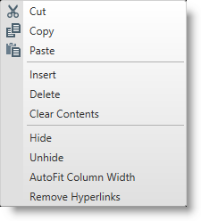
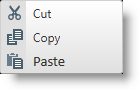
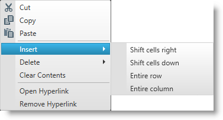
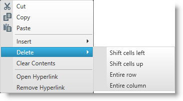
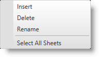
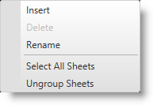

////

|metadata|
{
    "name": "spreadsheet-uiu-context-menu",
    "tags": ["Getting Started"],
    "controlName": ["{SpreadsheetName}"],
    "guid": "f92eac67-9767-4ca7-9baa-20f8b660b5e2",  
    "buildFlags": ["XAML"],
    "createdOn": "2015-11-06T16:53:37.0494056Z"
}
|metadata|
////

= Context Menu Interactions ({SpreadsheetName})

== Topic Overview

=== Purpose

This topic explains what operations can be performed by the user with the control’s context menu.

=== Required background

The following table lists the concept and topics required as a prerequisite to understanding this topic.

[options="header", cols="a,a"]
|====
|Type|Content

|Concept
|Infragistics Excel Engine
|==== 

[options="header", cols="a,a"] 

|==== 

|Topic|Purpose 

|pick:[wpf,sl,xaml=" link:igexcelengine-about-infragistics-excel-engine.html[About Infragistics Excel Engine]"] pick:[win-forms=" link:excelengine-understanding-the-infragistics-excel-engine.html[Understanding Infragistics Excel Engine]"] 

|In this section you will find information that will help you to better understand the object model and the functionalities of the _Infragistics Excel Engine_ . 

| link:spreadsheet-features.html[Features Overview ({SpreadsheetName})] 

|This topic explains in details the features of the link:{SpreadsheetLink}.{SpreadsheetName}.html[{SpreadsheetName}] control from developer perspective. 

| link:spreadsheet-visual-elements.html[Visual Elements Overview ({SpreadsheetName})] 

|This topic provides an overview of the visual elements of the {SpreadsheetName} control. 

|====

=== In this topic

This topic contains the following sections:

* <<_Ref389847435, Introduction >>
*  *Context Menu on Worksheet Column(s) or Row(s)* 
* <<_Ref396400575, Context Menu on Formula Editor and In-Place Editor >>
* <<_Ref396316992, Context Menu on Worksheet Cells >>
* <<_Ref396316999, Context Menu on Worksheets Tab Bar Area >>
* <<_Ref396313862, Related Content >>

[[_Ref389847435]]
== Introduction

=== Context menu summary

The {SpreadsheetName} control provides a context menu which is opened by right clicking on the control elements. The context menu allows the user to perform different operations depending on the elements on which the right click were performed.

The following {SpreadsheetName} elements have their specific context menus:

* Formula editor
* Worksheet column(s) or rows(s)
* Worksheet cells
* Worksheet cells within edit mode (in-place editor)
* Worksheet tab bar area

.Note
[NOTE]
====
If the user has more than one worksheet selected and perform clipboard operation on cell(s) in the active worksheet, all selected worksheets will be affected. Cut operation will move cells' content from all selected worksheets to the clipboard, copy operation will duplicate cells' content from all selected worksheets and paste operation will copy clipboard content into the specified cells in all selected worksheets.
====

[[_Ref396316984]]
== Context Menu on Worksheet Column(s) or Row(s)

=== Column(s) or row(s) context menu summary

The worksheet column(s) or row(s) context menu allows the user to:

* Perform clipboard operations on the selected column(s) or row(s)
* Insert/delete column(s) or row(s) or their content
* Hide/unhide and auto-size column(s) and row(s)
* Remove hyperlinks in the selected column(s) or row(s) which will remove the cells' worksheet hyperlinks only (formula hyperlinks will not be removed) but the cells' data content will be left intact

The following screenshot shows the worksheet column(s) or row(s) context menu:

[[_Ref396400575]]
== Context Menu on Formula Editor and In-Place Editor

=== Formula editor and in-place editor context menu summary

The control provides a context menu for the formula editor and for the cell's in-place editor which allows the user to perform clipboard operations.

The following screenshot shows the context menu for the formula editor and for the in-place editor:

[[_Ref396316992]]
== Context Menu on Worksheet Cells

=== Worksheet cells context menu summary

The worksheet cells context menu allows the user to:

* Perform clipboard operations over the cell(s)
* Insert new empty cells
* Delete cells or delete cells' content only
* Open hyperlink (available only when a single cell with hyperlink is selected)
* Remove hyperlink (only when at least one worksheet hyperlink is selected)

.Note
[NOTE]
====
Formula hyperlinks cannot be removed with the “Remove Hyperlink” context menu option.
====

The following screenshots show the worksheet cells context menu:

[[_Ref396316999]]
== Context Menu on Worksheets Tab Bar Area

=== Worksheet tab bar area context menu summary

The context menu of the worksheets tab bar area allows the user to:

* Insert new worksheet
* Delete existing worksheet
* Rename existing worksheet
* Select all worksheets
* Unselect all worksheets ("Ungroup Sheets" menu item)

The following screenshot shows the worksheets tab bar area context menu when one worksheet is selected:

The following screenshot shows the worksheets tab bar area context menu when several worksheets are selected:

[[_Ref396313862]]
== Related Content

=== Topics

The following topics provide additional information related to this topic.

[options="header", cols="a,a"]
|====
|Topic|Purpose

| link:spreadsheet-uiu-activation-navigation.html[Activation and Navigation Interactions ({SpreadsheetName})]
|This topic explains the supported user actions when navigating the control’s cells.

| link:spreadsheet-uiu-cell-editing.html[Cell Editing Interactions ({SpreadsheetName})]
|This topic explains what action can be performed by the user when editing cells.

| link:spreadsheet-uiu-columns-and-rows.html[Columns and Rows Interactions ({SpreadsheetName})]
|This topic explains what actions can be performed by the user when interacting with worksheet columns and rows.

| link:spreadsheet-uiu-formula-bar.html[Formula Bar Interactions ({SpreadsheetName})]
|This topic explains what actions can be performed by the user when interacting with the formula bar.

| link:spreadsheet-uiu-selection.html[Selection Interactions ({SpreadsheetName})]
|This topic explains the supported user actions when selecting cells, rows, or columns.

| link:spreadsheet-uiu-tab-bar-area.html[Tab Bar Area Interactions ({SpreadsheetName})]
|This topic explains what actions can be performed by the user when interacting with the worksheets.

|====