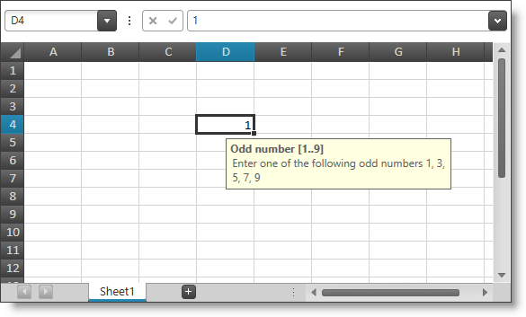
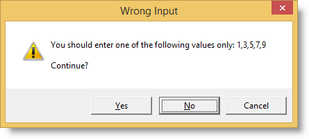
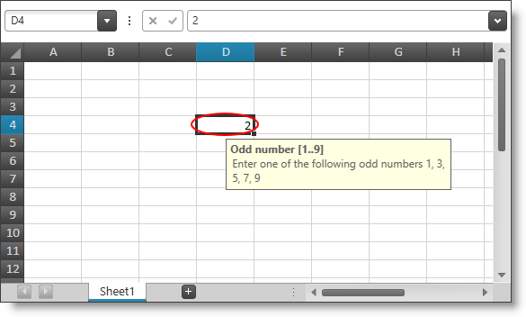

////

|metadata|
{
    "name": "spreadsheet-uiu-data-validation",
    "tags": ["Getting Started","Validation"],
    "controlName": ["{SpreadsheetName}"],
    "guid": "13726838-2887-4abf-a0ed-4a747d53229c",  
    "buildFlags": [],
    "createdOn": "2015-11-06T16:53:37.0513888Z"
}
|metadata|
////

= Data Validation Interactions ({SpreadsheetName})

== Topic Overview

=== Purpose

This topic explains what actions can be performed by the user in relation with the data validation feature.

=== Required background

The following table lists the concept and topics required as a prerequisite to understanding this topic.

[options="header", cols="a,a"]
|====
|Type|Content

|Concept
|Infragistics Excel Engine
|====

[options="header", cols="a,a"] 
|==== 
|Topic|Purpose 

|pick:[wpf,sl,xaml=" link:igexcelengine-about-infragistics-excel-engine.html[About Infragistics Excel Engine]"] pick:[win-forms=" link:excelengine-understanding-the-infragistics-excel-engine.html[Understanding Infragistics Excel Engine]"] 

|In this section you will find information that will help you to better understand the object model and the functionalities of the _Infragistics Excel Engine_ . 

| link:spreadsheet-features.html[Features Overview ({SpreadsheetName})] 

|This topic explains in details the features of the link:{SpreadsheetLink}.{SpreadsheetName}.html[{SpreadsheetName}] control from developer perspective. 

| link:spreadsheet-visual-elements.html[Visual Elements Overview ({SpreadsheetName})] 

|This topic provides an overview of the visual elements of the {SpreadsheetName} control. 

| link:spreadsheet-uiu-activation-navigation.html[Activation and Navigation Interactions ({SpreadsheetName})] 

|This topic explains the supported user actions when navigating the control’s cells. 

|====

=== In this topic

This topic contains the following sections:

* <<_Ref420504094, Introduction >>
* <<_Ref420504102, User Interactions and Usability >>
* <<_Ref420504109, Related Content >>

[[_Ref420504094]]
== Introduction

=== Summary

The {SpreadsheetName} control supports a data validation feature which allows you to set a validation rule on a cell which is used by the control to validate the user input. You can set only one rule per cell.

You can configure an input message to be shown when a cell with data validation rule is activated. This input message is shown in a floating box and has a description and an optional title. The input message has a default location center/bottom from the cell but will shift if there is not enough space. The input message can also be relocated by the user. Once dragged the input message will stay at that location for all cells in the same worksheet. You can also turn off showing the input message independently for each rule.

The following screenshot shows an input message under the current active cell:

After the user confirms a new cell value, this triggers the data validation for the edited cell (if this cell has a data validation rule set). If the data validation does not pass the validation rule may be configured to show an error message. There are three types of error messages – information, warning and stop. They are distinguished by different icon and different set of buttons. The error message also has a description and an optional title.

The table below shows the different error messages types and their properties:

[options="header", cols="a,a,a"]
|====
|Error message type|Buttons|Icon

|Information error message
|OK, Cancel
|image::images/xamSpreadsheet_val4.png[]

|Warning error message
|Yes, No, Cancel
|image::images/xamSpreadsheet_val5.png[]

|Stop error message
|OK, Cancel
|image::images/xamSpreadsheet_val6.png[]

|====

The following screenshot shows an error message of type warning:

You can also execute commands to show or hide circles around cells whose values does not pass the validation.

The following screenshot shows an invalid value circle around one of the control’s cells:

[[_Ref420504102]]
== User Interactions and Usability

=== User interactions summary chart

The following table summarizes the user interaction capabilities of the {SpreadsheetName} control related to the data validation feature.

[options="header", cols="a,a,a"]
|====
|The user can…|Using…|Details

|Relocate the input message
|Mouse drag the input message
|Relocate the input message box to a new convenient location.

|Restore default positioning logic of the input message
|Mouse double click on the input message
|After double click the default positioned logic will be restored.

|Trigger validation
|
* Press Enter 

* Press Ctrl+Enter 

* Press Ctrl+Shift+Enter 

* Click on anywhere outside the currently edited cell 

|The respective cell must have been in editing mode prior confirming the new value which triggers the data validation.

|Continue editing after unsuccessful data validation
|
* Click on "No" button of a warning type error dialog. 

* Click on the "OK" button of a stop type error dialog. 

|The cell will stay in editing mode.

|Revert to the previous value after an unsuccessful data validation
|Click on the "Cancel" button of any type of error dialog.
|The cell will exit editing mode and the old value will be restored.

|Accept invalid value after unsuccessful data validation
|
* Click on the "OK" button of an information type error dialog. 

* Click on the "Yes" button of a warning type error dialog. 

|The cell will exit editing mode and the new invalid value will be set.

|====

[[_Ref420504109]]
== Related Content

=== Topics

The following topics provide additional information related to this topic.

[options="header", cols="a,a"]
|====
|Topic|Purpose

| link:spreadsheet-conf-data-validation.html[Configuring Data Validation ({SpreadsheetName})]
|This topic explains how to configure and set the build-in data validation rules.

| link:spreadsheet-work-data-validation.html[Working with Data Validation ({SpreadsheetName})]
|This topic explains how to handle the data validation event and how to show circles around the cells with invalid data.

|====

ifdef::xaml[]

=== Sample

ifdef::xaml[]

The following sample provides additional information related to this topic.

[cols="a,a"]
|====
ifdef::xaml[]
|Sample|Purpose
endif::xaml[]

ifdef::xaml[]
| link:{SamplesURL}/spreadsheet/data-validation[Data Validation]
|This sample demonstrates the data validation feature of the control.
endif::xaml[]

|====

endif::xaml[]

endif::xaml[]