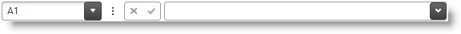

////

|metadata|
{
    "name": "spreadsheet-uiu-formula-bar",
    "tags": ["Getting Started","Layouts"],
    "controlName": ["{SpreadsheetName}"],
    "guid": "f1ed508e-f260-4d78-aa40-3784fe3d702b",  
    "buildFlags": [],
    "createdOn": "2015-11-06T16:53:37.0584176Z"
}
|metadata|
////

= Formula Bar Interactions ({SpreadsheetName})

== Topic Overview

=== Purpose

This topic explains what actions can be performed by the user when interacting with the formula bar.

=== Required background

The following table lists the concept and topics required as a prerequisite to understanding this topic.

[options="header", cols="a,a"]
|====
|Type|Content

|Concept
|Infragistics Excel Engine
|====
[options="header", cols="a,a"] 

|==== 

|Topic|Purpose 

|pick:[wpf,sl,xaml=" link:igexcelengine-about-infragistics-excel-engine.html[About Infragistics Excel Engine]"] pick:[win-forms=" link:excelengine-understanding-the-infragistics-excel-engine.html[Understanding Infragistics Excel Engine]"] 

|In this section you will find information that will help you to better understand the object model and the functionalities of the _Infragistics Excel Engine_ . 

| link:spreadsheet-features.html[Features Overview ({SpreadsheetName})] 

|This topic explains in details the features of the link:{SpreadsheetLink}.{SpreadsheetName}.html[{SpreadsheetName}] control from developer perspective. 

| link:spreadsheet-visual-elements.html[Visual Elements Overview ({SpreadsheetName})] 

|This topic provides an overview of the visual elements of the {SpreadsheetName} control. 

|====

=== In this topic

This topic contains the following sections:

* <<_Ref389847435, Introduction >>
* <<_Ref396312103, User Interactions and Usability >>
* <<_Ref396312109, Related Content >>

[[_Ref389847435]]
== Introduction

=== Formula bar summary

The {SpreadsheetName} control supports a designated area for cell content editing called Formula Bar positioned on top of the {SpreadsheetName}’s cells.

The following screenshot shows the {SpreadsheetName}’s formula bar:

The formula bar contains the following main areas from left to right:

* Name box – displays information about the current selection and provides support for cell navigation and named reference creation
* Drop down button for choosing a named reference
* Splitter – used to split the space between the name box and the other elements
* Cancel and confirm buttons – used for canceling or confirming the information entered in the formula editor
* Formula editor – used for editing the value of the currently selected worksheet cell
* Toggle button which toggles the formula bar height between a single line height and the last expanded height

==== Name box

The name box displays the address of the currently selected worksheet cell. The user may also use it for fast cell navigation by typing the cell address in it (for example "C15") and pressing the `Enter` key. In this case the {SpreadsheetName} will navigate to the cell with address "C15" and select it.

.Note
[NOTE]
====
The user may also type cells range (for example "B5:E9") or even multiple cells ranges (for example "B5:E9,G9:J12"). This will select a single or multiple cells range(s).
====

The name box can also be used for creating named references. Named references are used as aliases for a cell selection configuration (no matter whether this is a single cell selection, a cells range or multiple cells ranges). To create a named reference the user must first select the desired cell(s), then type the named reference in the name box and press the `Enter` key. To navigate to a particular named reference the user must select its name from the name box drop down.

==== Formula editor

The right side of the formula bar contains a text editor that can be used to edit the value of the cell.

This editor always displays the raw value of the active cell which means:

* Formula string is displayed instead of the calculated value
* No string formatting is rendered on the cell value

.Note
[NOTE]
====
Although the formula editor is showing raw cell value, the formatted value is simultaneously rendered in the {SpreadsheetName} cell as one edits in the formula editor. For example, selecting some text and pressing CTRL+B while editing text in the formula editor will not visibly change the formatting of the text in the formula editor, however the corresponding text in the associated worksheet cell will be formatted as *bold* .
====

The bottom edge of the formula editor may be dragged up or down to resize the editing area with a step equal to the height of a line of text in the editor. The toggle button on the right side of the formula editor can be used to toggle between a single line height and the last expanded height of the formula editor.

[[_Ref396312103]]
== User Interactions and Usability

=== User interactions summary chart

The following table summarizes the user interaction capabilities of the {SpreadsheetName}'s formula bar control.

[options="header", cols="a,a,a,a"]
|====
|The user can…|Using…|Details|Configurable?

|[[_Hlk377147553]] 

Navigate to a spreadsheet cell
|Typing its address in the name box (for example "D5")
|The control will navigate and select the cell
|image::images/No.png[]

|[[_Hlk377147649]] 

Navigate to and select a worksheet cells range
|Typing the cells range in the name box (for example "D5:F10")
|The control will navigate to the upper left cell of the range and select the specified cells range
|image::images/No.png[]

|Navigate to and select worksheet cells ranges
|Typing the cells ranges in the name box (for example "D5:F10,H3:I5")
|The control will navigate to the upper left cell of the first range and select all specified cell ranges
|image::images/No.png[]

|Create a named reference
|Select a cell, cells range or cells ranges, type the name for the named reference in the name box and press the `Enter` key
|The control will associate the selected cell, cells range or cells ranges with the specified name
|image::images/No.png[]

|Navigate to an existing named reference
|Choose the named reference from the name box drop down
|The control will navigate to the named reference and select the cell, cells range or cells ranges
|image::images/No.png[]

|Start editing of the active cell’s value
|Click in the formula editor
|The formula editor will enter edit mode, the name box will be disabled and the confirm and discard buttons will be enabled
|image::images/No.png[]

|Confirm the active cell’s new value
|
* Click on the confirm button 

* Press the `Enter` key 

|The control will update the cell with the new value
|image::images/No.png[]

|Discard the active cell’s new value
|
* Click on the discard button 

* Press the `Escape` key 

|The control will discard the new value in the formula editor and use the value prior start editing
|image::images/No.png[]

|====

[[_Ref396312109]]
== Related Content

=== Topics

The following topics provide additional information related to this topic.

[options="header", cols="a,a"]
|====
|Topic|Purpose

| link:spreadsheet-uiu-activation-navigation.html[Activation and Navigation Interactions ({SpreadsheetName})]
|This topic explains the supported user actions when navigating the control’s cells.

| link:spreadsheet-uiu-cell-editing.html[Cell Editing Interactions ({SpreadsheetName})]
|This topic explains what action can be performed by the user when editing cells.

| link:spreadsheet-uiu-columns-and-rows.html[Columns and Rows Interactions ({SpreadsheetName})]
|This topic explains what actions can be performed by the user when interacting with worksheet columns and rows.

| link:spreadsheet-uiu-selection.html[Selection Interactions ({SpreadsheetName})]
|This topic explains the supported user actions when selecting cells, rows, or columns.

|====