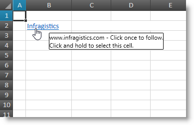

////
|metadata|
{
    "name": "spreadsheet-uiu-hyperlinks",
    "tags": ["Getting Started","Navigation"],
    "controlName": ["{SpreadsheetName}"],
    "guid": "85e207ea-ef51-4d65-b07b-870b7c7cc27b",
    "buildFlags": [],
    "createdOn": "2015-11-06T16:53:37.0604181Z"
}
|metadata|
////

= Hyperlinks Interactions ({SpreadsheetName})

== Topic Overview

=== Purpose

This topic explains what actions can be performed by the user when interacting with hyperlinks.

=== Required background

The following table lists the concept and topics required as a prerequisite to understanding this topic.

[options="header", cols="a,a"]
|====
|Type|Content

|Concept
|Infragistics Excel Engine
|==== 

[options="header", cols="a,a"] 

|==== 

|Topic|Purpose 

|pick:[xaml=" link:igexcelengine-about-infragistics-excel-engine.html[About Infragistics Excel Engine]"] pick:[win-forms=" link:excelengine-understanding-the-infragistics-excel-engine.html[Understanding Infragistics Excel Engine]"] 

|In this section you will find information that will help you to better understand the object model and the functionalities of the _Infragistics Excel Engine_ . 

| link:spreadsheet-features.html[Features Overview ({SpreadsheetName})] 

|This topic explains in details the features of the link:{SpreadsheetLink}.{SpreadsheetName}.html[{SpreadsheetName}] control from developer perspective. 

| link:spreadsheet-visual-elements.html[Visual Elements Overview ({SpreadsheetName})] 

|This topic provides an overview of the visual elements of the {SpreadsheetName} control. 

| link:spreadsheet-uiu-activation-navigation.html[Activation and Navigation Interactions ({SpreadsheetName})] 

|This topic explains the supported user actions when navigating the control’s cells. 

|====

=== In this topic

This topic contains the following sections:

* <<_Ref403562762, Introduction >>
* <<_Ref403562772, Followed State >>
* <<_Ref403562777, User Interactions and Usability >>
* <<_Ref403562782, Related Content >>

[[_Ref403562762]]
== Introduction

=== Hyperlinks summary

The {SpreadsheetName} control supports hyperlinks which are special text objects that can navigate the user to a specific location once clicked. Here is a list of the supported locations:

* Worksheet cell (may be in different worksheet)
* Worksheet cell range (may be in different worksheet)
* Named reference
* All other targets (like files, email address or internet address) are handled by the OS

Hyperlinks also supports tooltips when hovered with the mouse.

The following screenshot shows a hyperlink which display text is "Infragistics", its target is set to the Infragistics website and the tooltip is shown because the hyperlinks is hovered.

.Note
[NOTE]
====
For more information on how to create and customize hyperlinks in code look at the  pick:[xaml=" link:igexcelengine-addinghyperlinktoworksheet.html[Adding a Hyperlink to a Worksheet (Infragistics Excel Engine)]"]  pick:[win-forms=" link:excelengine-adding-a-hyperlink-to-a-cell-in-an-excel-file.html[Adding a Hyperlink to a Cell in an Excel File]"]  topic.
====

[[_Ref403562772]]
== Followed State

=== Followed state summary

The {SpreadsheetName} control supports a followed state for each hyperlink instance. This state is transient and will be retained until the moment you close the opened workbook. After reopening the workbook all links will have they followed state cleared.

When the user clicks a hyperlink this will set its followed state and also change the rendering of the hyperlinks by using different style (by default followed hyperlinks are rendered brownish and underlined).

The followed state is tracked by hyperlink’s instance (not by hyperlink’s target location) which means if you have more than one hyperlink targeting the same location only the clicked hyperlinks will be rendered as followed.

[[_Ref403562777]]
== User Interactions and Usability

=== User interactions summary chart

The following table summarizes the user interaction capabilities of the {SpreadsheetName}'s hyperlinks.

[options="header", cols="a,a,a,a"]
|====
|The user can…|Using…|Details|Configurable?

|Follow a hyperlink
|
* Click on the hyperlink 

* Right click on a cell(s) containing hyperlink and choose the “Open Hyperlink” menu item 

|After clicking this hyperlink it followed state will be set and it will be rendered differently.
|image::images/Yes.png[] 

pick:[xaml="link:spreadsheet-work-hyperlinks.html[Working with Hyperlinks ({SpreadsheetName})]"] pick:[win-forms="link:excelengine-adding-a-hyperlink-to-a-cell-in-an-excel-file.html[Adding a Hyperlink to a Cell in an Excel File]"] 

|Select a cell that contains hyperlink
|
* Click on an empty space around the hyperlink 

* Press mouse button on the hyperlink and hold it pressed for a second 

|N/A
|image::images/No.png[]

|Show a hyperlink’s tooltip
|Hover the hyperlink with the mouse
|The tooltip will be hidden once the mouse leaves the hyperlinks bounds
|image::images/Yes.png[] 

pick:[xaml="link:igexcelengine-addinghyperlinktoworksheet.html[Adding a Hyperlink to a Worksheet (Infragistics Excel Engine)]"] 
pick:[win-forms="link:excelengine-adding-a-hyperlink-to-a-cell-in-an-excel-file.html[Adding a Hyperlink to a Cell in an Excel File]"] 

|====

ifdef::xaml[]
.Note
[NOTE]
====
There are user options for opening and removing hyperlinks available in the {SpreadsheetName}'s context menus which are described in the link:spreadsheet-uiu-context-menu.html[Context Menu Interactions ({SpreadsheetName})] topic. 
====
endif::xaml[]

[[_Ref403562782]]
== Related Content

=== Topics

The following topics provide additional information related to this topic.

[options="header", cols="a,a"]
|====
|Topic|Purpose

| link:spreadsheet-uiu-cell-editing.html[Cell Editing Interactions ({SpreadsheetName})]
|This topic explains what action can be performed by the user when editing cells.

| link:spreadsheet-uiu-columns-and-rows.html[Columns and Rows Interactions ({SpreadsheetName})]
|This topic explains what actions can be performed by the user when interacting with worksheet columns and rows.

| link:spreadsheet-uiu-selection.html[Selection Interactions ({SpreadsheetName})]
|This topic explains the supported user actions when selecting cells, rows, or columns.

ifdef::xaml[]
| link:spreadsheet-uiu-context-menu.html[Context Menu Interactions ({SpreadsheetName})]
|This topic explains what operations can be performed by the user with the control’s context menu.
endif::xaml[]

| link:spreadsheet-work-hyperlinks.html[Working with Hyperlinks ({SpreadsheetName})]
|This topic explains what type of hyperlinks are supported and how to operate with them.

|====