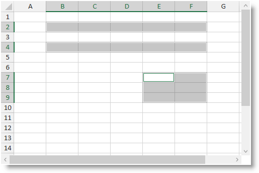

////
|metadata|
{
    "name": "spreadsheet-uiu-selection",
    "tags": ["Getting Started","Selection"],
    "controlName": ["{SpreadsheetName}"],
    "guid": "897755f2-589c-48a5-a141-707a0c4d2dbb",
    "buildFlags": [],
    "createdOn": "2015-11-06T16:53:37.0623873Z"
}
|metadata|
////

= Selection Interactions ({SpreadsheetName})

== Topic Overview

=== Purpose

This topic explains what actions can be performed by the user when selecting worksheet cells.

=== Required background

The following table lists the concept and topics required as a prerequisite to understanding this topic.

[options="header", cols="a,a"]
|====
|Type|Content

|Concept
|Infragistics Excel Engine
|====
[options="header", cols="a,a"] 

|==== 

|Topic|Purpose 

|pick:[xaml=" link:igexcelengine-about-infragistics-excel-engine.html[About Infragistics Excel Engine]"] pick:[win-forms=" link:excelengine-understanding-the-infragistics-excel-engine.html[Understanding Infragistics Excel Engine]"] 

|In this section you will find information that will help you to better understand the object model and the functionalities of the _Infragistics Excel Engine_ . 

| link:spreadsheet-features.html[Features Overview ({SpreadsheetName})] 

|This topic explains in details the features of the link:{SpreadsheetLink}.{SpreadsheetName}.html[{SpreadsheetName}] control from developer perspective. 

| link:spreadsheet-visual-elements.html[Visual Elements Overview ({SpreadsheetName})] 

|This topic provides an overview of the visual elements of the {SpreadsheetName} control. 

| link:spreadsheet-uiu-activation-navigation.html[Activation and Navigation Interactions ({SpreadsheetName})] 

|This topic explains what action can be performed by the user when navigating through the worksheet cells. 

|====

=== In this topic

This topic contains the following sections:

* <<_Ref389847435, Introduction >>
* <<_Ref389847442, User Interactions and Usability >>
* <<_Ref389847446, Related Content >>

[[_Ref389847435]]
== Introduction

=== Selection summary

The {SpreadsheetName} control supports the following selection modes: *Normal* 

In this mode new selection range is created each time the user is dragging the mouse or navigating via the keyboard and replaces any existing selection. New selection ranges may be added via the mouse while holding the Ctrl key. *ExtendedSelection* 

The selection range is only one and it is enclosed between the active cell and the cell selected by the mouse or navigating the keyboard. The user may use the mouse while holding the Ctrl key to move the active cell. *AddToSelection* 

New cell ranges are added without the need of holding the Control key. The user may click on cell(s) to add it (them) to the current selection.

The following screenshot shows the {SpreadsheetName} control in normal selection mode with three selection ranges. The first two ranges are on the 2nd and 4th row. The 3rd selection range occupies columns E and F and rows 7 through 9 and has the active cell at address E7.

[[_Ref389847442]]
== User Interactions and Usability

=== User interactions summary chart

The following table summarizes the user interaction capabilities of the {SpreadsheetName} control.

[options="header", cols="a,a,a,a"]
|====
|The user can…|Using…|Details|Configurable?

|[[_Hlk377147553]] 

Select a single cell
|
* Click on it 

* Press Shift + Arrow key 

|A single cell will be selected (it will be also the active cell).
|image::images/Yes.png[] 

link:spreadsheet-conf-selection.html[Configuring Selection ({SpreadsheetName})]

|[[_Hlk377147649]] 

Select a range of cells
|
* Click the start cell and drag 

* Hold the Shift key pressed and select cells with Arrow keys 

|A range of cells will be selected. The cell from which the user starts the selection range will be the active cell.
|image::images/Yes.png[] 

link:spreadsheet-conf-selection.html[Configuring Selection ({SpreadsheetName})]

|Select several cells/cell ranges
|Hold Control key pressed while selecting cells/cell ranges
|Use the steps described in the previous two table rows to add single cell or multiple cell ranges to the current selection.
|image::images/Yes.png[] 

link:spreadsheet-conf-selection.html[Configuring Selection ({SpreadsheetName})]

|Enter/Exit *ExtendedSelection* mode
|Press F8
|This key combination will toggle between *Normal* and *ExtendedSelection* modes.
|image::images/No.png[]

|Enter/Exit *AddToSelection* mode
|Press Shift + F8
|This key combination will toggle between *Normal* and *AddToSelection* modes.
|image::images/No.png[]

|====

.Note
[NOTE]
====
If the user has more than one worksheet selected and perform selection in the active worksheet all other selected worksheets will get the same selection and subsequent operations will be executed over all selected worksheets.
====

[[_Ref389847446]]
== Related Content

=== Topics

The following topics provide additional information related to this topic.

[options="header", cols="a,a"]
|====
|Topic|Purpose

| link:spreadsheet-conf-selection.html[Configuring Selection ({SpreadsheetName})]
|This topic explains how to configure the selection feature.

| link:spreadsheet-work-selection.html[Working with Selection ({SpreadsheetName})]
|This topic explains the selection feature from developer perspective.

|====