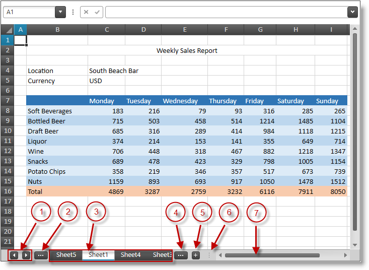

////
|metadata|
{
    "name": "spreadsheet-uiu-tab-bar-area",
    "tags": ["Getting Started","Navigation"],
    "controlName": ["{SpreadsheetName}"],
    "guid": "dc111bf8-6e47-49ef-910f-d7e01a59d6f7",
    "buildFlags": [],
    "createdOn": "2015-11-06T16:53:37.0643882Z"
}
|metadata|
////

= Tab Bar Area Interactions ({SpreadsheetName})

== Topic Overview

=== Purpose

This topic explains what actions can be performed by the user when interacting with the worksheets.

=== Required background

The following table lists the concept and topics required as a prerequisite to understanding this topic.

[options="header", cols="a,a"]
|====
|Type|Content

|Concept
|Infragistics Excel Engine
|====
[options="header", cols="a,a"] 

|==== 

|Topic|Purpose 

|pick:[xaml=" link:igexcelengine-about-infragistics-excel-engine.html[About Infragistics Excel Engine]"] pick:[win-forms=" link:excelengine-understanding-the-infragistics-excel-engine.html[Understanding Infragistics Excel Engine]"] 

|In this section you will find information that will help you to better understand the object model and the functionalities of the _Infragistics Excel Engine_ . 

| link:spreadsheet-features.html[Features Overview ({SpreadsheetName})] 

|This topic explains in details the features of the link:{SpreadsheetLink}.{SpreadsheetName}.html[{SpreadsheetName}] control from developer perspective. 

| link:spreadsheet-visual-elements.html[Visual Elements Overview ({SpreadsheetName})] 

|This topic provides an overview of the visual elements of the {SpreadsheetName} control. 

| link:spreadsheet-uiu-activation-navigation.html[Activation and Navigation Interactions ({SpreadsheetName})] 

|This topic explains what actions can be performed by the user when navigating through the worksheet cells. 

|====

=== In this topic

This topic contains the following sections:

* <<_Ref391050456, Worksheet Tabs Navigation >>
* <<_Ref389847442, User Interactions and Usability >>
* <<_Ref389847446, Related Content >>

[[_Ref391050456]]
== Worksheet Tabs Navigation

=== Worksheet tabs navigation summary

The user may use the {SpreadsheetName}'s tabs area under the worksheet's cells to navigate and manage the worksheets.

[start=1]
. Left and right arrow keys used to scroll the worksheets tabs area
[start=2]
. Button for activating the previous worksheet
[start=3]
. Worksheets area with tabs for each worksheet of the opened workbook
[start=4]
. Button for activating the next worksheet
[start=5]
. "Plus" button for adding new worksheet
[start=6]
. Splitter used to split the area between the worksheet tabs and the horizontal scrollbar
[start=7]
. Horizontal scrollbar of the active worksheet

[[_Ref389847442]]
== User Interactions and Usability

=== User interactions summary chart

The following table summarizes the user interaction capabilities of the {SpreadsheetName}'s worksheets tabs area.

[options="header", cols="a,a,a,a"]
|====
|The user can…|Using…|Details|Configurable?

|Select worksheet
|Click on the desired worksheet tab in the worksheet tabs area
|N/A
|image::images/No.png[]

|Navigate worksheets
|Press `Ctrl` + `Page Up` or `Ctrl` + `Page Down` keys
|N/A
|image::images/No.png[]

|Multiple worksheets selection
|Click on the first worksheet tab, then press and hold `Ctrl` key and click on other worksheet tabs
|N/A
|image::images/No.png[]

|Create new worksheet
|Use the "plus" button right of the worksheet tabs
|The new worksheet tab will be added on right of the currently selected worksheet tab
|image::images/Yes.png[] 

pick:[xaml="link:igexcelengine-workbook-protection.html[Workbook Protection (Infragistics Excel Engine)]"]

|Rename worksheet
|Double click on the worksheet’s tab
|An in-place editor will be shown and the user may edit the worksheet tab’s name. Renaming is confirmed by pressing the Enter key
|image::images/Yes.png[] 

pick:[xaml="link:igexcelengine-workbook-protection.html[Workbook Protection (Infragistics Excel Engine)]"]

|Reorder worksheet
|Click on a worksheet tab and drag it to a new position
|The worksheet tab will be reordered
|image::images/Yes.png[] 

pick:[xaml="link:igexcelengine-workbook-protection.html[Workbook Protection (Infragistics Excel Engine)]"]

|Navigate through the worksheet tabs
|Click the left or right arrow buttons left of the worksheet tabs
|The three dot buttons on both sides are shown when more worksheet tabs are available in the respective direction
|image::images/No.png[]

|Resize the worksheets tab bar area
|Use the splitter on right of the "plus" button
|N/A
|image::images/Yes.png[] 

link:spreadsheet-conf-tab-bar-area.html[Configuring Tab Bar Area ({SpreadsheetName})]

|====

.Note
[NOTE]
====
You can restrict workbook's structural changes using the workbook's link:{ApiPlatform}documents.excel{ApiVersion}{ApiProp}infragistics.documents.excel.workbook~protect.html[Protect] method. Workbook's structural changes include: inserting, renaming, deleting and reordering of worksheets. To enable the above operations use the workbook's link:{ApiPlatform}documents.excel{ApiVersion}{ApiProp}infragistics.documents.excel.workbook~unprotect.html[Unprotect] method.
====

[[_Ref389847446]]
== Related Content

=== Topics

The following topics provide additional information related to this topic.

[options="header", cols="a,a"]
|====
|Topic|Purpose

| link:spreadsheet-conf-tab-bar-area.html[Configuring Tab Bar Area ({SpreadsheetName})]
|This topic explains how to configure the worksheets.

| link:spreadsheet-conf-selection.html[Configuring Selection ({SpreadsheetName})]
|This topic explains how to configure the selection feature.

| link:spreadsheet-work-selection.html[Working with Selection ({SpreadsheetName})]
|This topic explains the selection feature from developer perspective.

|====