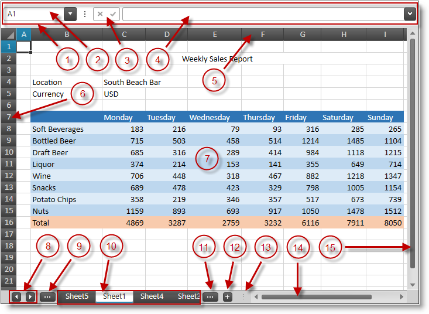

////
|metadata|
{
    "name": "spreadsheet-visual-elements",
    "tags": ["Getting Started"],
    "controlName": ["{SpreadsheetName}"],
    "guid": "e63b2721-19a9-4279-9a44-be2085c78d9c",
    "buildFlags": [],
    "createdOn": "2015-11-06T16:53:37.0393869Z"
}
|metadata|
////

= Visual Elements Overview ({SpreadsheetName})

== Topic Overview

=== Purpose

This topic provides an overview of the visual elements of the control.

=== Required background

The following table lists the concept and topics required as a prerequisite to understanding this topic.

[options="header", cols="a,a"]
|====
|Type|Content

|Concept
|Infragistics Excel Engine
|====
[options="header", cols="a,a"] 

|==== 

|Topic|Purpose 

|pick:[xaml=" link:igexcelengine-about-infragistics-excel-engine.html[About Infragistics Excel Engine]"] pick:[win-forms=" link:excelengine-understanding-the-infragistics-excel-engine.html[Understanding Infragistics Excel Engine]"] 

|In this section you will find information that will help you to better understand the object model and the functionalities of the _Infragistics Excel Engine_ . 

| link:spreadsheet-features.html[Features Overview ({SpreadsheetName})] 

|This topic explains in details the features of the link:{SpreadsheetLink}.{SpreadsheetName}.html[{SpreadsheetName}] control from developer perspective. 

|====

=== In this topic

This topic contains the following sections:

* <<_Ref396138837, Visual Elements of  {SpreadsheetName}  Control and Related Properties >>
* <<_Ref396138870, Related Content >>

[[_Ref396138837]]
== Visual Elements of {SpreadsheetName} Control and Related Properties

=== Visual elements summary

The following screenshot depicts the visual elements of the {SpreadsheetName} control. The configurable elements are listed after the image.

[start=1]
. Formula Bar
[start=2]
. Name Box
[start=3]
. Decline and confirm buttons of the Formula Editor
[start=4]
. Formula Editor
[start=5]
. Column headers
[start=6]
. Row headers
[start=7]
. Spreadsheet data cells
[start=8]
. Buttons for scrolling the worksheet tabs list
[start=9]
. Button for activating the previous worksheet
[start=10]
. List of worksheets available in the opened workbook (the current worksheet is displayed with different color)
[start=11]
. Button for activating the next worksheet
[start=12]
. Button for adding worksheet to the opened workbook
[start=13]
. Splitter used to divide the space between the worksheets tab bar area and the horizontal scrollbar
[start=14]
. Horizontal scrollbar
[start=15]
. Vertical scrollbar

.Note
[NOTE]
====
Bullets from 8 to 12 are forming the worksheets tab bar area.
====

=== Visual elements and related properties

The following table maps the visual elements of the {SpreadsheetName} control and the properties that configure them.

[options="header", cols="a,a,a"]
|====
|Visual Element|Property(ies)|Topic(s)

|Formula Bar
|
* pick:[xaml=" link:{SpreadsheetLink}.{SpreadsheetName}{ApiProp}isformulabarvisible.html[IsFormulaBarVisible]"] pick:[win-forms=" link:{SpreadsheetLink}.formulabar{ApiProp}visible.html[FormulaBar.Visible]"] 

* link:{ApiPlatform}documents.excel{ApiVersion}{ApiProp}infragistics.documents.excel.customviewwindowoptions~showformulabar.html[ShowFormulaBar] 

| link:spreadsheet-uiu-formula-bar.html[Formula Bar Interactions ({SpreadsheetName})]

|Column and row headers
|
* link:{SpreadsheetLink}.{SpreadsheetName}{ApiProp}areheadersvisible.html[AreHeadersVisible] 

* link:{ApiPlatform}documents.excel{ApiVersion}{ApiProp}infragistics.documents.excel.displayoptions~showrowandcolumnheaders.html[ShowRowAndColumnHeaders] 

|N/A

|Spreadsheet data cells
|
* link:{SpreadsheetLink}.{SpreadsheetName}{ApiProp}aregridlinesvisible.html[AreGridlinesVisible] 

* link:{ApiPlatform}documents.excel{ApiVersion}{ApiProp}infragistics.documents.excel.displayoptions~showgridlines.html[ShowGridlines] 

| link:spreadsheet-conf-cell-editing.html[Configuring Cell Editing ({SpreadsheetName})]

|Worksheets tab bar area
|
* link:{ApiPlatform}documents.excel{ApiVersion}{ApiProp}infragistics.documents.excel.windowoptions~tabbarvisible.html[TabBarVisible] 

* link:{ApiPlatform}documents.excel{ApiVersion}{ApiProp}infragistics.documents.excel.windowoptions~tabbarwidth.html[TabBarWidth] 

|
* link:spreadsheet-uiu-tab-bar-area.html[Tab Bar Area Interactions ({SpreadsheetName})] 

* link:spreadsheet-conf-tab-bar-area.html[Configuring Tab Bar Area ({SpreadsheetName})] 

|====

[[_Ref396138870]]
== Related Content

=== Topics

The following topics provide additional information related to this topic.

[options="header", cols="a,a"]
|====
|Topic|Purpose

| link:spreadsheet-user-interactions.html[User Interactions and Usability ({SpreadsheetName})]
|The topics in this section explain what actions can be performed by the user.

|====